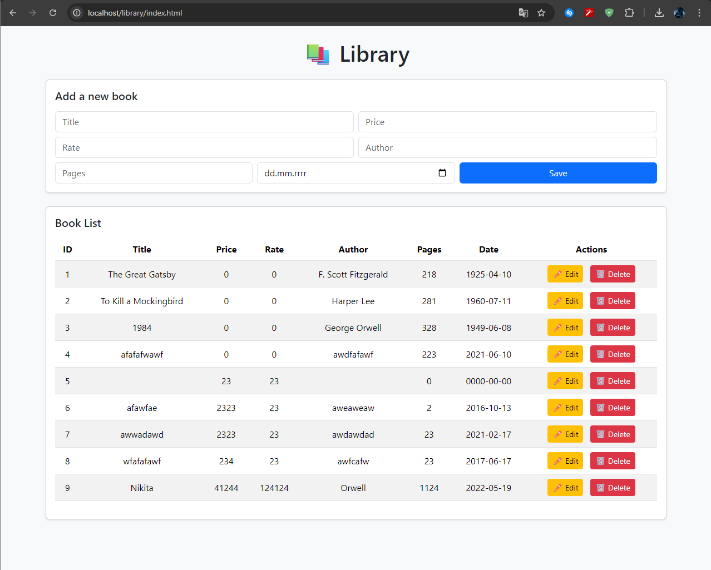

Library — PHP CRUD with Bootstrap

Requirements
- XAMPP (Apache + MySQL)
- PHP 7.4+

Installation
1. Copy folder `Library` in `\xampp\htdocs\`.
2. Run Apache and MySQL in XAMPP.
3. Open `http://localhost/phpmyadmin` and execute:
   ```sql
   CREATE DATABASE library;
   USE library;
   CREATE TABLE books (
       id INT AUTO_INCREMENT PRIMARY KEY,
       title VARCHAR(255) NOT NULL,
       author VARCHAR(255) NOT NULL,
       pages INT NOT NULL,
       published_date DATE NOT NULL
   );

   INSERT INTO books (title, author, pages, published_date) VALUES
   ('The Great Gatsby', 'F. Scott Fitzgerald', 218, '1925-04-10'),
   ('To Kill a Mockingbird', 'Harper Lee', 281, '1960-07-11'),
   ('1984', 'George Orwell', 328, '1949-06-08');